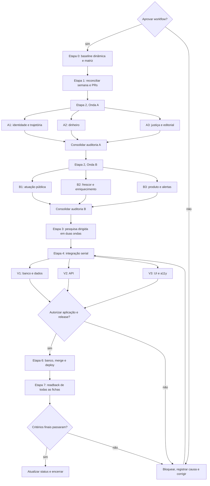

# Workflow: completude e confiabilidade das fichas 2026

Status: **Etapa 5 concluída; integração local aprovada pelos verificadores e Etapa 6 aguardando segundo gate**.

Execução ativa: `pf-completeness-20260807T022551Z`, branch local
`codex/profiles-complete-2026`. Banco de produção, publicação editorial, merge,
deploy e email continuam fora da autorização atual.

Baseline revalidada em 06/08/2026:

- `main` remoto em `0cf39b41ef7fe7fc0d8177ed1fe0775b974cc435`;
- 194 fichas públicas no último snapshot comprovado, número que deve ser
  redescoberto no início de cada execução;
- 60 fichas com índice 100 e 134 abaixo de 100 no último snapshot;
- PRs abertas #127 (bloqueada), #114 (conflitante) e #72 (draft atrasada);
- CI e CodeQL do `main` sem estado totalmente verde nesta revalidação;
- readback público confirmado no início da execução pelo domínio canônico,
  incluindo 194 slugs e o SHA `0cf39b41` em `/api/deployment-info`; uma nova
  leitura continua obrigatória antes de qualquer publicação.

Este workflow transforma a amostragem de bugs dos presidenciáveis e todo o
trabalho acumulado da semana em uma fila fechada por candidato e frente. Ele não
autoriza pesquisa, escrita no banco, merge, deploy ou envio de email por si só.

O eval obrigatório está em
[`CANDIDATE_DATA_COMPLETENESS_EVAL.md`](CANDIDATE_DATA_COMPLETENESS_EVAL.md).
Nenhuma onda começa sem o self-test do golden set, e nenhum marco termina sem
100% dos graders daquele marco em `PASS`.

## Objetivo final

Cada candidato publicável à Presidência, aos governos estaduais e ao Governo do
Distrito Federal deve ter todos os dados públicos possíveis e aplicáveis na
ficha. Uma frente só termina quando percorre:

```text
fonte -> identidade -> coleta -> validação -> persistência -> API/DTO
      -> cache -> renderização -> readback público
```

O êxito será medido pela matriz dinâmica `candidato x frente x campo`, nunca
pelo número de buscas, scripts, commits, migrations ou PRs.

### Critérios finais de sucesso

1. 100% do universo eleitoral vigente tem ficha pública e identidade segura.
2. Todo campo aplicável está `publicado` ou `vazio_confirmado`.
3. `nao_coletado`, `erro`, `indeterminado` e `partial` permanecem visíveis como
   dívida com responsável e próxima ação; nunca se tornam zero ou ficha limpa.
4. Não existe dado concluído apenas em pesquisa, arquivo, script, migration,
   banco, API ou tela de revisão.
5. CI e CodeQL estão verdes no SHA integrado.
6. O deployment público serve esse SHA e o readback de todas as fichas passa.

## Escopo de dados e superfícies

A matriz deve cobrir, quando aplicável:

- identidade, situação eleitoral, chapa, cargo e território;
- biografia, profissão, formação, atuação pública e propostas;
- histórico eleitoral, mandatos, partidos e mudanças partidárias;
- patrimônio, financiamento, receitas, doadores e despesas;
- votações, projetos, produção legislativa e gastos de mandato;
- processos, sanções, alertas, contradições e pontos positivos;
- foto, redes, site, notícias e datas de verificação;
- cards-resumo, contadores, CTAs, páginas de detalhe e alertas por email.

O universo inicial de 194 fichas é uma fotografia, não uma constante. Entradas,
saídas e mudanças de situação durante a execução devem recalcular a matriz.

## Problemas da amostragem e solução global

| # | Problema observado | Regra para todo o site | Prova de saída |
|---|---|---|---|
| 1 | Data antiga rotulada como dado atual | Separar data de curadoria da ficha e data de verificação por fonte/frente; remover a regra binária de 75 dias | Nenhuma frente chama dado antigo de atual; estados recente, desatualizado, erro e pendente testados |
| 2 | Alertas vazios ocupam área e repetem zeros | Um único estado vazio informativo, com escopo, fonte e data; esconder duplicação sem esconder dívida | Varredura das fichas sem dois contadores/caixas equivalentes |
| 3 e 9 | CTA de votação vazia aponta para trajetória ou legislação por contagem | CTA definido por semântica e aplicabilidade, não pela aba com maior número | Matriz de estados garante destino coerente para voto aplicável, não aplicável e não coletado |
| 4 | Total de financiamento diverge dos segmentos e o donut mascara a diferença | Reconciliar soma, registrar categoria residual justificada ou corrigir a fonte; percentuais usam o total real | Zero divergência entre total, segmentos, percentuais, card e detalhe |
| 5 | Justiça não verificada usa texto longo e CTA irrelevante | Estado curto e neutro, com escopo consultado; CTA leva à ação ou detalhe pertinente | Zero CTA para legislação em estado judicial vazio |
| 6 | Ficha sem histórico TSE fica estruturalmente vazia | Priorizar biografia, profissão, formação, atuação pública, propostas e candidaturas atuais; eleitoral vira N/A ou pendência explícita | Todas as fichas sem histórico eleitoral têm conteúdo público aplicável e estados honestos |
| 7 | Ausência de mandato vira contradição | Nunca tratar não ter mandato como alerta; mostrar como informação neutra de trajetória | Zero alertas/contradições gerados só por ausência de mandato |
| 8 | Histórico desconhecido para partido atual conta como troca | Ancorar o partido na candidatura mais antiga confirmada; não inferir filiação contínua nem contar desconhecido como troca | Zero eventos `desconhecido -> partido` contados como troca e casos homólogos auditados |
| 10 e 12 | Processo anulado mantém gravidade vermelha, categoria criminal e resumo truncado | Exibir histórico judicial e estado anulado com redação neutra, fundamento e escopo exatos; manter contexto acessível | Zero anulado com severidade ativa; resumo e detalhe concordam e não ocultam a anulação |
| 11 | Alertas por email existem só parcialmente | Só ligar após teste real de cadastro, confirmação, envio, cancelamento e monitoramento | Evidência E2E em caixa de teste e rollback exercitado |
| 13 | Identificadores e jargão interno vazam para o leitor | Traduzir estados técnicos em texto público; manter `SQ_CANDIDATO` apenas em superfícies internas | Scanner de UI não encontra nomes de colunas ou identificadores internos |
| 14 | Pesquisa e migrations da semana não aparecem na ficha | Todo artefato recebe destino por candidato/frente e só fecha após readback público | Inventário semanal 100% classificado como integrado, substituído, bloqueado ou descartado com motivo |

## Guardrails

- Nunca associar identidade, CPF ou registro sensível apenas por nome.
- Persistência eleitoral exige `SQ_CANDIDATO` confirmado ou outra chave oficial
  aceita pelo contrato da fonte.
- Falha de rede ou transporte nunca vira `vazio_confirmado`.
- Ausência de linha nunca prova ausência de fato.
- Filiação contínua não pode ser inferida. Candidaturas confirmadas ao mesmo
  partido são fatos pontuais e podem ancorar a linha do tempo, sem preencher os
  intervalos como filiação comprovada.
- Curadoria de processos, alertas, contradições e outros itens editoriais exige
  decisão explícita por item antes da publicação.
- Nenhum agente de pesquisa escreve no banco, cria migration, faz merge, deploy
  ou envia email.
- Um único integrador é dono das migrations, dos arquivos compartilhados, da
  escrita remota e do release.
- Dois bloqueios idênticos sem evidência nova encerram a tentativa daquela
  frente e abrem uma decisão objetiva. Não há loop infinito de busca.

## Plano por etapas

### Etapa 0: baseline congelada e contrato de execução

**Responsável:** orquestrador raiz.

**Entradas:** `main` remoto, roster público, régua de cobertura, ledger de
migrations, `coleta_log`, APIs, páginas públicas, PRs e branches abertas.

**Entregável:** `execution_id` e matriz congelada com uma linha por
`candidato + frente + campo`, incluindo identidade, aplicabilidade, estado,
fonte, data, dado exibido e próxima ação.

**Verificação:** slugs únicos, cardinalidade por cargo/UF, zero colisões de
identidade e checksum dos snapshots de banco/API/site.

**Fallback:** se a produção estiver inacessível, gerar apenas uma baseline
provisória e interromper qualquer decisão de publicação até o readback voltar.

**Gate 0:** nenhum agente começa pesquisa sem roster e esquema de saída iguais.
O self-test `npm run eval:completude:self-test` também precisa passar.

### Etapa 1: reconciliação do trabalho da semana

**Responsável:** orquestrador raiz, com verificador somente leitura.

**Entradas:** commits, PRs, migrations, relatórios, decisões editoriais,
downloads, logs de coleta e artefatos de revisão de 30/07 a 06/08.

**Entregável:** inventário que classifica cada artefato como:

- integrado e comprovado na ficha;
- integrado sem efeito público comprovado;
- ainda útil e a portar para o `main` atual;
- substituído por implementação superior;
- bloqueado por identidade, fonte, aprovação ou infraestrutura;
- descartado, com razão e sem perda de dado superior.

As PRs #127, #114 e #72 entram aqui. Nenhuma será mergeada às cegas; deltas
úteis serão portados para a integração atual e branches obsoletas poderão ser
encerradas apenas em uma etapa autorizada.

**Verificação:** todo artefato do inventário tem candidato/frente ou justificativa
estrutural e nenhum item fica em estado genérico “feito”.

**Fallback:** quando dois artefatos divergirem, prevalece a evidência primária
mais atual; o conflito vira bloqueio explícito se não houver vencedor seguro.

### Etapa 2: auditoria global em paralelo

É uma etapa somente leitura. O orquestrador mantém a matriz compartilhada; cada
agente escreve apenas no diretório temporário exclusivo da sua frente.

#### Onda A

| Agente | Propriedade exclusiva | Auditoria sobre todo o universo | Entregável |
|---|---|---|---|
| A1 Identidade e trajetória | Identidade, candidatura, cargo, partido, mandatos, aplicabilidade | Homônimos, SQ, histórico eleitoral, ausência de mandato, continuidade e troca partidária | Manifesto de correções e bloqueios por candidato |
| A2 Dinheiro | Patrimônio, financiamento, receitas, doadores e despesas | Cobertura, datas, somas, moedas, percentuais, categorias residuais e divergências card/detalhe | Reconciliação numérica por eleição e candidato |
| A3 Justiça e editorial | Processos, sanções, alertas, contradições e pontos positivos | Identidade processual, estado atual, anulações, neutralidade, fonte por afirmação e fila dos 204 CNJs | Manifesto editorial sem aplicação |

#### Onda B

| Agente | Propriedade exclusiva | Auditoria sobre todo o universo | Entregável |
|---|---|---|---|
| B1 Atuação pública | Votos, projetos, produção legislativa e gastos de mandato | Matriz de aplicabilidade por casa/período e lacunas reais | Universo finito de itens e estados por candidato |
| B2 Frescor e enriquecimento | Bio, profissão, formação, propostas, foto, redes, site e notícias | Novas declarações, fontes mais recentes, direitos de imagem, links e datas por fonte | Atualizações propostas com evidência datada |
| B3 Produto e alertas | Estados vazios, CTAs, contadores, resumos, detalhes e email | Repetição visual dos bugs em todas as fichas e contrato E2E de email | Matriz de regressões e plano de teste público |

**Verificação da etapa:** 100% dos candidatos têm uma conclusão para cada frente:
valor encontrado, vazio confirmado, não aplicável, inconclusivo, não coletado ou
erro. “Sem linha” não é conclusão.

Os agentes também produzem os resultados dos casos do golden set que pertencem
à sua frente. O próprio agente não gradua esses resultados.

**Fallback:** identidade ambígua bloqueia só o candidato/campo afetado; fonte
indisponível preserva o dado anterior e registra erro. O agente não tenta outra
fonte inferior para fabricar fechamento.

### Etapa 3: pesquisa e coleta dirigida em paralelo

**Responsáveis:** os mesmos agentes A1-A3 e B1-B3, em duas ondas de no máximo
três agentes, priorizando somente lacunas da matriz.

**Entradas:** manifestações da Etapa 2, fontes canônicas e conectores/scripts já
versionados no projeto.

**Entregável:** propostas normalizadas por campo com identidade, valor, data,
fonte, trecho sustentador, resultado da consulta, aplicabilidade e confiança.

**Verificação:** cada proposta passa por schema, enum, data, URL, identidade,
deduplicação e comparação com o valor público atual.

**Fallback:** depois de duas tentativas iguais sem evidência nova, marcar o
bloqueio e sua causa. Trocar de fonte só é permitido quando ela tem autoridade
compatível para o fato em questão.

### Etapa 4: consolidação e implementação serial

**Responsável exclusivo:** orquestrador/integrador raiz.

**Entradas:** manifestos aprovados das Etapas 2 e 3.

**Entregável:** uma branch de integração curta, baseada no `main` atual, com:

1. correções de causas compartilhadas na ordem: identidade/aplicabilidade,
   persistência, API/DTO, componentes e cache;
2. migrations cumulativas em allowlist fechada, geradas por um único autor;
3. registros de `coleta_log` coerentes com o resultado real de cada fonte;
4. testes de regressão para todos os problemas da tabela;
5. relatório de impacto antes/depois na matriz.

Arquivos de alto conflito, como seed canônico, `supabase/migrations`, DTOs,
componentes de ficha, cache e `Settings/STATUS.md`, não são editados em paralelo.

**Verificação:** diff focado, migration dry-run, cardinalidade e somas, gate de
identidade, testes, typecheck, lint, build e CI no SHA exato.

**Fallback:** se a integração misturar domínios demais, dividir em PRs verticais
curtas, cada uma terminando em readback da frente. Não manter várias branches
longas com migrations concorrentes.

### Etapa 5: verificação independente em paralelo

| Verificador | Prova mínima | Falha que bloqueia |
|---|---|---|
| V1 Dados | dry-run, allowlist, identidade, cardinalidade, somas, duplicatas e readback direto do banco | Migration inesperada, identidade ambígua ou total divergente |
| V2 API | todos os slugs, contratos de campos/estados, fontes e datas | Campo presente no banco e ausente/errado no DTO |
| V3 Produto | todas as fichas por scanner e amostras representativas em desktop/mobile/a11y | CTA, estado, contador, truncamento ou jargão incoerente |

A curadoria editorial é verificada contra o recibo de aprovação item a item. Os
204 CNJs revisados não são publicados em bloco só porque foram classificados.

**Entregável:** parecer `pass`, `fail` ou `partial` por gate, com evidência.

O release exige `PASS`, não `partial`, em todos os critérios do eval. V1-V3
rodam os graders e registram a evidência sem editar o objeto verificado.

**Fallback:** qualquer `fail` volta ao integrador com reprodução mínima. O mesmo
erro repetido duas vezes sem nova evidência interrompe a frente e pede decisão.

### Etapa 6: aplicação e lançamento serial

Esta etapa exige nova autorização explícita, além da aprovação deste workflow.

**Responsável exclusivo:** orquestrador raiz.

**Ordem obrigatória:**

```text
CI verde -> aprovação editorial necessária -> ledger local/remoto
-> dry-run com allowlist -> aplicação no banco -> readback direto
-> PR revisada -> merge conhecido -> deployment Ready no mesmo SHA
-> revalidação de cache -> APIs -> páginas -> auditoria de cobertura
```

**Verificação:** nenhuma etapa aceita o sucesso da etapa anterior como prova da
seguinte. O SHA precisa coincidir entre PR, `main`, deployment e endpoint de
informação de deploy.

**Fallback:** migration inesperada, CI vermelho, deploy divergente ou produção
inacessível interrompem o lançamento. Não usar bypass sem autorização específica.

### Etapa 7: readback do universo e encerramento

**Responsável:** orquestrador, com V1-V3 em leitura paralela.

**Entregável:** comparação antes/depois por candidato e frente, contendo:

- universo vigente, ficha 200 e identidade;
- campos aplicáveis publicados ou vazio confirmado;
- fontes e datas visíveis;
- zero regressões dos problemas da amostragem;
- bloqueios restantes, responsável e ação executável;
- atualização de `Settings/STATUS.md` e dos logs canônicos.

**Verificação final obrigatória:**

```text
0 colisões de identidade
0 totais financeiros irreconciliados
0 ausência de mandato classificada como contradição
0 desconhecido -> partido contado como troca
0 CTA vazio semanticamente incorreto
0 processo anulado com severidade ativa ou contexto oculto
0 jargão/identificador interno na UI
100% das fichas vigentes acessíveis
100% dos campos aplicáveis com estado explícito e fonte/procedência
```

Alertas por email têm gate próprio: cadastro, confirmação, envio real a uma
caixa de teste, descadastro/exclusão e monitoramento devem passar antes de ligar
o recurso para usuários. A ativação em produção exige aprovação específica.

## Diagrama do workflow



## Agentes e prevenção de conflitos

### Regras de execução

- Máximo de três subagentes ativos além do orquestrador.
- Onda A termina antes de Onda B para respeitar os quatro slots disponíveis.
- Cada agente recebe o mesmo `execution_id`, roster congelado, schema de saída e
  critérios de parada.
- Pesquisa e auditoria usam diretórios temporários exclusivos, por exemplo
  `/tmp/puxaficha-<execution_id>/<agente>/`.
- Agentes não alteram arquivos compartilhados nem revertem mudanças alheias.
- O orquestrador é o único autor de migrations e único operador do banco,
  GitHub, Vercel, cache e status canônico.
- Worktrees persistentes são proibidas. Se uma isolação temporária for realmente
  necessária, ela nasce em diretório `mktemp`, tem branch própria e é removida
  após portar e verificar o resultado.

### Contrato de handoff de cada agente

Cada agente deve entregar:

1. escopo efetivamente varrido e contagens;
2. arquivo normalizado por candidato/campo;
3. evidência e data por afirmação;
4. diferenças em relação ao site atual;
5. bloqueios de identidade, fonte ou aplicabilidade;
6. testes que deveriam falhar antes da correção;
7. nenhuma escrita remota e nenhum claim de publicação.

### Prompt-base para despacho

O orquestrador usa este contrato em todos os despachos e acrescenta a
propriedade exclusiva da tabela de agentes:

```text
Você é o agente <ID> do workflow de completude do Puxa Ficha.
Objetivo: auditar <FRENTE> em todo o roster congelado do execution_id <ID_EXECUCAO>.
Leia Settings/README.md e siga a hierarquia de fontes do projeto.
Você não está sozinho no repositório. Não reverta nem edite arquivos de outros
agentes. Trabalhe somente em <DIRETORIO_EXCLUSIVO> e não altere seed, migrations,
DTOs, componentes compartilhados, banco, GitHub, Vercel ou produção.

Para cada candidato/campo, entregue: identidade oficial, aplicabilidade, valor
atual no site, resultado da pesquisa, fonte e data, diferença proposta, estado
final e bloqueio. Falha de transporte não é vazio confirmado. Nome não basta
para persistir identidade. Pare depois de duas tentativas iguais sem evidência
nova. Não declare publicação.

Definição de pronto: 100% do roster recebeu uma conclusão explícita na sua
frente, o manifesto passou no schema comum e as contagens fecham com a baseline.
```

O prompt específico de A3 também proíbe aplicar os 204 CNJs sem recibo
editorial item a item. O de B3 proíbe enviar email ou ligar o recurso. V1, V2 e
V3 recebem o SHA exato e não podem corrigir o próprio objeto verificado.

## Entregáveis por marco

| Marco | Artefato | Definição de pronto |
|---|---|---|
| M0 | Baseline e matriz | Universo, identidade e estados reproduzíveis |
| M1 | Inventário semanal | Nada pesquisado/baixado/auditado fica sem destino |
| M2 | Seis manifestos globais | Todos os candidatos auditados em todas as frentes |
| M3 | Fila de dados saneada | Propostas verificadas e bloqueios honestos |
| M4 | Branch de integração | Causa compartilhada corrigida do dado ao frontend |
| M5 | Parecer de verificadores | Banco, API e UI aprovados no mesmo SHA |
| M6 | Release autorizado | Banco, merge, deploy e cache comprovados em sequência |
| M7 | Relatório público antes/depois | Todas as fichas relidas e `STATUS.md` atualizado |

## Fallbacks operacionais

1. **Fonte oficial indisponível:** preservar último dado confiável, registrar
   `erro`, data e próxima tentativa; nunca declarar ausência.
2. **Identidade ambígua:** quarentena por campo/candidato; nenhuma persistência.
3. **Conflito entre fontes:** fonte primária e mais específica prevalece; sem
   resolução segura, manter `indeterminado` visível.
4. **PR antiga conflitante:** portar só o delta ainda útil para o `main` atual e
   retestar; não resolver conflito mecanicamente.
5. **Migration fora da allowlist:** parar antes de qualquer escrita.
6. **CI/CodeQL vermelho:** diagnosticar e corrigir; não usar estado local como
   substituto do gate remoto.
7. **Produção ou DNS indisponível:** não declarar publicado; retomar no readback.
8. **Email sem entrega real:** manter o recurso desligado e não simular sucesso.
9. **Dois bloqueios repetidos:** encerrar a tentativa, registrar evidência e
   pedir a menor decisão necessária.

## Gate de aprovação

A aprovação deste documento libera apenas as Etapas 0 a 5: baseline,
reconciliação, auditorias, pesquisa dirigida, implementação em branch e
verificação. Ela **não** libera escrita no banco de produção, merge, deploy,
publicação editorial ou envio/ativação de email.

A aprovação também congela os critérios do eval. Se um critério precisar mudar,
a alteração deve ser aprovada antes de ver o resultado que ela afetará. Critério
não pode ser rebaixado depois de um `FAIL`.

Para começar, responder:

```text
APROVAR WORKFLOW DE COMPLETUDE
```

Antes da Etapa 6, será apresentado um segundo gate com SHA, migrations exatas,
itens editoriais, resultados dos verificadores, impacto esperado e rollback.
